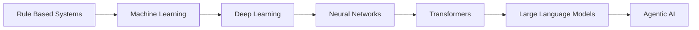

<div align="center">

# 🤖 Large Language Models (LLMs)
### The Complete Deep Dive into Modern AI


---

## 🌌 AI Evolution



---

# 🧠 What Is an LLM?

A Large Language Model (LLM) is a neural network trained on massive amounts of text data.

Its goal is simple:

> Predict the next token.

Example:

```
The capital of France is ___
```

The model predicts:

```
Paris
```

But after billions of training examples, it learns:

- Language
- Facts
- Reasoning patterns
- Programming
- Mathematics
- Writing styles
- Conversation

---

# 🏗 Complete LLM Architecture

```text
User Input
     │
     ▼
Tokenization
     │
     ▼
Embeddings
     │
     ▼
Transformer Layers
     │
     ├── Multi-Head Attention
     ├── Feed Forward Networks
     ├── Residual Connections
     ├── Layer Normalization
     ▼
Output Logits
     │
     ▼
Softmax
     │
     ▼
Predicted Token
```

---

# 📚 NLP (Natural Language Processing)

Natural Language Processing allows computers to understand human language.

Examples:

✅ Translation

✅ Summarization

✅ Chatbots

✅ Question Answering

✅ Sentiment Analysis

✅ Text Generation

---

## Traditional NLP

Before Transformers:

- Bag of Words
- TF-IDF
- N-Grams
- Hidden Markov Models
- RNN
- LSTM
- GRU

Problems:

❌ Limited context

❌ Forget long sequences

❌ Slow training

---

# 🚀 The Transformer Revolution

Published in 2017.

Paper:

### "Attention Is All You Need"

Transformers changed AI forever.

Key idea:

> Use Attention instead of recurrence.

Benefits:

✅ Faster training

✅ Better context

✅ Parallel processing

✅ Scales extremely well

---

# 👀 Attention Mechanism

Attention decides:

> Which words are important?

Sentence:

```
The animal didn't cross the road because it was tired.
```

What is "it"?

Attention helps identify:

```
it → animal
```

---

## Attention Formula

```math
Attention(Q,K,V)
=
Softmax(
QKᵀ / √d
)
V
```

Where:

| Symbol | Meaning |
|----------|----------|
| Q | Query |
| K | Key |
| V | Value |

---

# 🎯 Self Attention

Each word looks at every other word.

Example:

```
ChatGPT understands language
```

Word:

```
understands
```

attends to:

- ChatGPT
- language

to gather context.

---

# 🎯 Multi-Head Attention

Instead of one attention mechanism:

```
Head 1 → Grammar

Head 2 → Meaning

Head 3 → Relationships

Head 4 → Context
```

Many perspectives simultaneously.

---

# 🔢 Tokens

Models don't see words.

Models see tokens.

Example:

```
ChatGPT is amazing
```

May become:

```
[8142, 374, 9231]
```

Tokens can represent:

- Words
- Parts of words
- Characters

---

# 🔥 Tokenization

Converts text into tokens.

Example:

```
Artificial Intelligence
```

might become

```
Artificial
Intelli
gence
```

This reduces vocabulary size.

---

# 🌐 Embeddings

Embeddings convert tokens into vectors.

Example:

```
Dog
```

↓

```text
[0.23, 1.24, -0.18, ...]
```

Words with similar meanings have similar vectors.

Example:

```
King
Queen
Prince
Princess
```

appear close together.

---

# 🗺 Vector Space

```text
      Queen
         ●

King ●

             Princess ●

      Prince ●
```

Similar concepts cluster together.

---

# 🏋️ Training Process

Dataset:

```
Books
Websites
Articles
Code
Research Papers
```

Training loop:

```text
Text
 ↓
Tokenization
 ↓
Prediction
 ↓
Error Calculation
 ↓
Backpropagation
 ↓
Weight Updates
```

Repeated billions of times.

---

# 📉 Loss Function

Loss measures prediction error.

Lower loss = better model.

Goal:

```
Loss → Minimum
```

---

# 🔄 Backpropagation

Model learns from mistakes.

Steps:

1. Predict
2. Compare with answer
3. Calculate error
4. Adjust weights

Millions of times.

---

# ⚡ Gradient Descent

Optimizer updates weights.

Popular optimizers:

- SGD
- Adam
- AdamW

---

# 🧩 Neural Networks

Basic structure:

```text
Input Layer
     ↓
Hidden Layers
     ↓
Output Layer
```

Transformers are advanced neural networks.

---

# 🏛 Transformer Block

```text
Input
  │
  ▼
Multi Head Attention
  │
  ▼
Add & Normalize
  │
  ▼
Feed Forward
  │
  ▼
Add & Normalize
```

Repeated many times.

Examples:

- 32 layers
- 80 layers
- 120+ layers

---

# 💾 Parameters

Parameters are learned numbers.

Examples:

- 7 Billion
- 13 Billion
- 70 Billion
- 175 Billion
- 1 Trillion+

More parameters generally mean more capability.

---

# 🧠 Context Window

How much text the model remembers.

Examples:

```
8K Tokens
32K Tokens
128K Tokens
1M+ Tokens
```

Larger context:

✅ Better memory

✅ Long documents

✅ Large conversations

---

# 🔍 RAG (Retrieval Augmented Generation)

Problem:

Models cannot know everything.

Solution:

RAG

```text
Question
   │
   ▼
Vector Database
   │
Retrieve Documents
   │
   ▼
LLM
   │
   ▼
Answer
```

Benefits:

✅ Current information

✅ Company knowledge

✅ Better accuracy

---

# 🗄 Vector Databases

Store embeddings.

Popular examples:

- Pinecone
- Weaviate
- Qdrant
- ChromaDB
- FAISS

Search is done using:

```
Cosine Similarity
```

instead of keywords.

---

# 🤖 AI Agents

Traditional LLM:

```
Input → Output
```

Agent:

```text
Think
 ↓
Plan
 ↓
Use Tools
 ↓
Observe
 ↓
Act
```

Capabilities:

- Search Web
- Write Code
- Use APIs
- Analyze Data

---

# 🧰 Tool Calling

Modern LLMs can call tools.

Examples:

- Weather API
- Calculator
- Database
- Search Engine

This extends model capabilities.

---

# 🎓 Fine Tuning

Improves a model for specific tasks.

Examples:

- Medical
- Finance
- Legal
- Customer Support

Methods:

- Full Fine Tuning
- LoRA
- QLoRA

---

# 🏆 RLHF

Reinforcement Learning from Human Feedback

Process:

```text
Human Ratings
      ↓
Reward Model
      ↓
Optimization
      ↓
Improved Responses
```

Used to align AI behavior.

---

# 🛡 AI Safety

Important areas:

- Hallucinations
- Bias
- Alignment
- Privacy
- Security
- Guardrails

---

# 🌟 Modern AI Stack

```text
Frontend
    │
    ▼
API Layer
    │
    ▼
LLM
    │
 ┌──┴──────┐
 ▼         ▼

RAG      Tools

 ▼         ▼

Vector DB APIs
```

---

# 🚀 Future of AI

Emerging areas:

- Multimodal Models
- AI Agents
- Robotics
- Autonomous Systems
- Reasoning Models
- Scientific Discovery

---

# 📖 Topics Covered

✅ NLP

✅ Tokenization

✅ Embeddings

✅ Attention

✅ Self Attention

✅ Multi Head Attention

✅ Transformers

✅ Training

✅ Loss Functions

✅ Gradient Descent

✅ Neural Networks

✅ Parameters

✅ Context Windows

✅ RAG

✅ Vector Databases

✅ Fine Tuning

✅ RLHF

✅ Tool Calling

✅ Agentic AI

✅ AI Safety

---

<div align="center">

### ⭐ If you learned something, give this repository a star!


</div>
